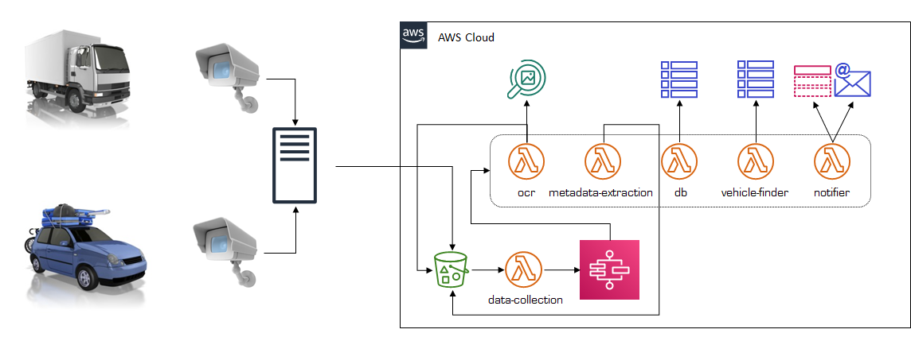
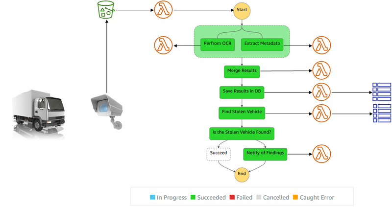

# Toll-Registry application

## The business need
A system supporting toll collections with an add-on for notifications e.g., detecting a stolen vehicle based on registration number recognition

## Reasons to change the present solution
- The current solution does not meet expectations for high availability
  - Frequent interruptions in operation cause measurable financial losses
- Performance and scalability issues
  - The relational database makes up the bottleneck of the system as a whole
- The monolithic structure of the app impedes effective and efficient scaling (out and in)
- The OCR module generates incorrect readings of registration numbers
  - Error-prone identification of vehicles incurs high administrative costs
    - Due to manual procedures and human effort to handle hundreds of complaints per month
- The obsolete library for metadata extraction
  - The code is no longer developed and updated – as a result, it has become vulnerable
- The limited reuse capability of OCR and notification modules
  - The module code is firmly embedded in the application monolith
  - The copy/paste method is used as a temporary workaround
  - As a result, there are problems with the code integrity and its maintenance
    - Where is the appropriate code repository, or "source of truth"?

# The current app structure – typical monolith

# Functional requirements
- Store photos of license plates
- Identify and read out the plate registration numbers in real-time
- Save data from the photos (including EXIF metadata) in a database
- Search for stolen vehicle numbers
- Send notifications about occurring events

# Non-functional requirements
- The system is to be:
  - Highly-available
  - Scalable
  - Cost-efficient
    - Expenses should change along with the workload/proportionately to the app load
- The system must ensure:
  - Security and redundancy of relevant data
- The solution should characterize:
  - Low personnel costs as to system maintenance, operation, and administration

# Architecture

## Major architectural decisions

- The AWS Cloud as a runtime environment
- Justification:
  - A flexible payment model – primarily pay-as-you-go/pay-for-use 
  - A broad portfolio of services embracing all the tools of the trade
    - Or at least the majority of them
    - Indispensable to build a fully operational system
  - A single, well-integrated runtime environment
    - Reduces administrative effort
    - Brings down management and maintenance costs
- Hence assumption:
    - Leverage AWS services where possible and warranted
- The application structure as microservices with their "light", scalable instances driven by a data flow manager 
- The entire AWS infrastructure, service, resource, application and CI/CD setup is accomplished with IaC (Infrastructure As Code) approach 

## Microservice architecture

## AWS multi-account architecture

## Microservices on AWS as AWS Lambda

## Caveats & exclusions
- The architecture shown here doesn't include the part of the system responsible for:
  - Authentication and authorization (AuthN/Z)
  - Steering cameras over MQTT (IoT)
- The implementation of AuthN/Z and MQTT:
  - In the "legacy" app with:
    - Spring Security library and Rabbit MQ/ActiveMQ message engines (handling MQTT) respectively
  - In the Cloud version by:
    - Amazon Cognito, IAM, and AWS IoT Core

# Implementation

## The leveraged AWS services

## Microservices included the workflow:

- [Data collection service](https://github.com/developing-cloud/data-collection)
- [OCR service](https://github.com/developing-cloud/ocr)
- [Metadata extraction service](https://github.com/developing-cloud/metadata-extraction)
- [DB access service](https://github.com/developing-cloud/db)
- [Notification service](https://github.com/developing-cloud/notifier)
- [Stolen vehicles search service](https://github.com/developing-cloud/vehicle-finder)

## Step Functions as a backbone of the application 

## Remarks
- To facilitate grasping how the entire solution works, the demo app has been:
  - Simplified to the maximum
    - Also the microservice APIs have been reduced to the minimum
  - Devoid of:
    - Tests, comments 
    - Fully-fledged logging
    - Suitable exception handling
      - However, it still leverages native mechanisms for error handling intrinsically built-in in the services
    - Compensation and transaction handling
    - Entirely described as simple executable code, including configuration and setup

# The DevOps approach
## CI/CD

AWS CodeCommit as a code repository

AWS CodePipeline with CodeBuild and CloudFormation for CI/CD implementation.

### Setup
CDK is used for setting up the CI/CD pipelines. 
The project [Tools](https://github.com/developing-cloud/tools)
 comprises the entire configuration needed to set it up from scratch.

### Maintenance
CDK is leveraged for the CI/CD pipelines maintenance.
Any changes to the pipelines should be applied with CDK.

## Monitoring
- CloudWatch with standard metrics
- CloudWatchLogs for Toll Registry microservices logs
- X-Ray for observability

